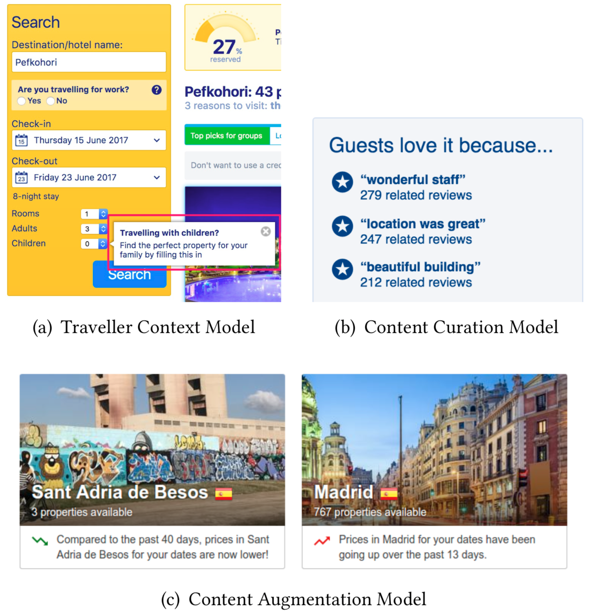

## 摘要
booking.com是全世界最大的在线旅行服务商。拥有数以百万的消费者和数以百万的酒店提供者，形式包括传统酒店、公寓、民宿、客房等等。早在几年前，我们就运用机器学习技术来提高客户体验及业务指标了。大部分的机器学习的文章都关注在算法和数据相关的方面，很少有人能说明在一个商业利益至上的工业化社会里机器学习技术是如何能产生真正有意义的影响的。我们分析了150个面向消费者的成功的机器学习应用，这些应用是由booking里不同的团队开发的，为全世界数十亿用户使用，并且通过了严格的随机对照实验（RCT）测试。接下来会说明一下我们使用的方法，遇到的挑战和将一个如此复杂的技术推广运用到整个组织的过程中总结的经验教训。我们的主要结论是，一个迭代的、假设驱动的过程，与其他学科相结合，是构建 150 个成功的机器学习产品的基础。
## 1、绪论
booking.com是全世界最大的在线旅行服务商。拥有数以百万的消费者和数以百万的酒店提供者，酒店形式包括传统酒店、公寓、民宿、客房等等。我们的平台是由许多不同的产品线上拥有不同专业的团队开发的，包括像booking助手这样的大型应用程序，或者是像搜索结果页这样的具有重要商业价值的网页，也可以是某个网页的一部分，比如在搜索结果页最下面的目的地推荐。不同团队有他们不同的目的，并且使用不同的业务指标来衡量他们的产品价值以及验证假设，这是我们学习过程的核心。我们平台遇到的几个独有的挑战我将他们简短的列在下面：
**高风险：** 如果推荐错了电影、音乐、书籍和产品会影响用户体验。但绝大部分情况都有可以“撤销”的机会：不听这首歌或不看这个电影，甚至是将不满意的商品退货。但是，一旦你到了住的地方才发现和你想象的不一样，就没那么容易撤销了，你会产生强烈的不满感觉并且离开我们的平台。
**查询输入特别少：** 用户搜索酒店的时候仅仅会提供他们的目的地，可能还有预定日期和客人的人数。要从这种几乎是0输入的情况下提供令人满意的预定和居住体验是我们的关键挑战之一。
**商品对象复杂：** 预定一个酒店需要用户在目的地，日期，酒店类型，房间数量，房间类型，退款策略等多个方面考虑。当一个可被预定的对象确定下来之后这些元素就构成了一个多维空间，而且并不是所有的排列组合都是可选的，所以非常难做决定，我们的用户需要帮助来找到最佳组合。
**供应受到约束：** 酒店的可预订状态是受限和动态的。结合价格，会直接影响消费者的偏好和供应商的行为。而这在设计用户体验时是不能被忽略的因素。
**持续的冷启：** 消费者通常处在一个持续冷启的状态中。大部分人一年只进行一到两次的旅行活动。当他再次回到我们网站事，他的偏好可能已经有了很大的改变，用户的历史信息通常变得不太重要。并且，每天都有新的酒店和酒店类型加入，他们没有足够的评价和描述内容，比如图片和多语言描述，这使得很难给到他们曝光。无论一个用户访问booking的频率如何，都能提供个性化的体验，并且，在一个新的酒店加入进来的一开始就能给他找到合适的受众，是我们面临的又一困难且非常重要的问题。
**内容过载：** 租所包含了非常丰富的内容，包括描述、图片、评价和打分。目的地本身也有很多内容，包括房客拍的照片，自然文本的评论内容，访客的推荐和指南。这是个非常强大的广告工具，但同时也非常复杂和难以被消费者认知。将如此丰富的内容以一种友好的方式呈现给用户，并且利用好这部分信息对我们平台来说又是一个关键的挑战。
去年我们用机器学习技术来解决这些和其他一些问题。我们发现要真正的影响商业业绩难的超乎想象，此外，要将模型的的工作和观测到的影响独立开来或者理解他们的联系也很难。相关的问题被其他一些人也提到。Wagstaff发表论文称缺乏如何运用机器学习并在现实问题中产生相关影响的研究和经验。有一个和我们的课题更相近的例子，Jannach等介绍了在推荐系统领域如何用很少的指标来对推荐服务的指标产生影响，比如销售多样性，转化率或者忠诚度。很多其他的期刊也发表了各种具体的机器学习已经他们取得的商业成就的例子，但据我们所知还没有通过机器学习获得商业和用户价值的产品研发测试全过程的研究。
在这个项目中我们分析了150成功的面向消费者的机器学习应用（以及许多相关的失败），分享我们遇到的挑战，我们是如何应对的，我们从中总结的经验教训和一般性建议。包括：
- 关于机器学习在一个商业产品中的影响的大规模研究，据我们所知，这是业界的第一个。
- 一组涵盖了机器学习工程全部阶段的“经验总结”。
- 一组解决我们在各个阶段发现的问题的技术解决方案。
论文接下来的部分将按照开发一个机器学习应用的具体研发阶段来组织，用初始，建模，开发，监控和评估命名，以及在最后一节我们做了个总结。
## 2、初始阶段：机器学习就是产品开发中的瑞士军刀
在基于机器学习的工程的初始阶段，产品团队产生点子、假设、商业案例等等，机器学习作为解决方案的一部分。我们学到的一个重要经验就是机器学习可以在不同环境中广泛的被运用到各种不同的产品中。在实践中，我们的模型是帮助不同团队提升他们的产品或者从他们的用户中学习的工具。极端情况下，我们为一个用例建立非常专用的模型。例如，用来优化用户界面中一个特定元素的大小，或者在一个特定环境下的点击流漏斗中提供个性化的推荐。因为是专用模型，我们可以设计和调优到非常好的性能，以期望他们能创造强烈的商业影响。相反，他们的应用仅限于很少的一些用例。另一方面，我们也建立模型来表达有意义*语义层*。这些模型可以理解抽象概念，可以让人在产品开发中基于模型的输出用来做新功能介绍、千人千面、促销信息推送等等。例如，他可以指征一个用户在旅行目的地上的灵活性，给到产品团队一个目的地弹性的概念，这样他们就可以提升他们的产品。这些模型提供了一个可解释的信号，并且在产品团队希望使用他们的所有上下文中都有效。这样的需求限制了将模型的预测结果和特定的商业目标结合在一起，但是这些模型的广泛使用抵消了这个缺点，整个平台上生成了几十个用例。具体地说，在我们的分析中，我们发现平均每个语义模型生成的用例是专用用例的两倍。
### 2.1 模型系列
接下来这些段落探索了我们平台上已经开发的不同模型的系列，关注在他们怎么被产品团队使用来影响我们的用户的。这种分类方法可以作为一种理清机器学习能力的一个思维工具，形成我们解决绪论部分提到的问题的策略主干。
#### 2.1.1 旅行者偏好模型
用户在不同的方面会表现出从无弹性到完全可弹的不同弹性。我们考虑了旅行的一些属性，像目的地，酒店价格，酒店位置，质量，日期，特色设施等等，为这些属性建设了一组机器学习模型，总的来说，构建了一个用户偏好的指标集给每一个属性分配一个弹性级别。这一类模型工作_语义层_。举个例子，日期弹性模型会给出一个用户对于旅行日期的弹性的量化评估。假如用户是有弹性的，在相关场景下就会给日期推荐，但是如果用户对此没有弹性，日期推荐就会造成用户的分心和疑惑，因此就不会显示。另外一种处理日期没弹性用户的方式是，用价格趋势或者是否可预订等信息来强化用户所选择的日期。
#### 2.1.2 旅行者情境模型
人们会以不同的角色进行旅行，和伴侣一起、和家人一起、和朋友一起或只是自己一个人，为了奢华享受或者只是商务出差。他们可能驱车去一个附近的城市，或者坐飞机去世界的另一边，他们可能在一个城市待很长一段时间，也可能在几个城市之间赶场。以上所有的这些例子都是我们所说的_旅行者情境_ ，它包含了一次旅行中的约束和需求。在我们平台上，大部分的这种情境都是不够明确的状态，但其实是可以被清楚描述的，只是被很多用户所遗忘了。因此，在用户预定过程中越早的预测或者猜测到用户所处的情境就越有价值。旅行者情境模型也是工作在语义层的。在这个例子中，研发团队就可以为不同的情境构建不同的特征。家庭出行模型就能预测一次用户的预定行为有多大概率是为家庭出行而进行的。有时候，家庭旅行者忘了填他们随行孩子的个数（如图1（a）），导致在预定过程都走了一大半了才发现选择的酒店不支持儿童入住。家庭出行模型就会提醒用户尽早的填写随行儿童的信息，避免造成上述令人失望的情况。

                                                                            图1：机器学习模型应用举例
                                                                            
#### 2.1.3 商品浏览模型
大部分用户在寻找酒店的时候，都会通过几个条件来筛选，比如日期、属性、政策、位置等等。为了做出决定，他们必须跟踪他们看到的选项，同时探索相似的选项来做预定决定。我们的商品浏览模型既从这个过程中获得知识，又希望改善它。他们做出不同的动作，包括滚动、点击、排序、过滤等等。这些都会作为用户偏好的一种潜在反馈。这些信号可以被用来加速访问用户访问历史中的相关商品，也可以在全局范围内更快的召回相关商品。
#### 2.1.4 用户界面优化模型
字体的大小、列表中展示商品的个数、背景颜色和背景图片、视觉元素的存在与否等等，所有的这些都对以业务指标来衡量用户行为有很大的影响。这组模型为不同的业务目标来分别优化这些参数。我们发现很难用一个一刀切的特定的值来对此进行优化，所以我们的模型同时考虑了上下文和用户的信息来做出就好的关于界面优化的决定。
#### 2.1.5 内容归纳
内容以文本、结构化的调研和照片等形式来描述目的地、地标、酒店等等，这些内容可能有酒店官方、客户、公共数据库等不同的来源。这里面有巨大的机会因为这些内容可以作为广告将用户吸引到特定的城市、日期甚至具体的酒店去。但这也非常复杂，信息量巨大且充满噪音，导致很难被用户使用。**内容归纳** 就是让这些内容可以被人类所使用的过程。举个例子，我们收集了150万酒店超过17.1亿条的评价，这里面包含了许多关于酒店提供的特色服务的非常有价值的信息，并且这也是一个非常丰富的卖点信息来源。机器学习模型会去归纳这些评论，把酒店的亮点通过结构化的简短的总结表达出来（如图1（b））。
#### 2.1.6 内容增强
在用户浏览、选择、预定和评价一个酒店的全过程中，给我们传递了一些隐藏的信号，这些信号帮助我们对酒店能提供的服务和质量有了更深刻的理解。这组模型通过酒店的属性、目的地、甚至特定的日期信息来增强和清晰化酒店能提供的服务。内容增强有别于内容归纳的地方是，内容归纳是把已经存在的内容变得更加容易获得和理解，而内容增强是用其他方面的各种数据来增强对一个实体的描述。为了说明这个观点，我们来举两个例子：
- **最具性价比**: booking提供了丰富的酒店选择，以设施、位置、服务和设施的质量、政策和许多其他维度的形式提供不同级别的价值。用户需要评估房间的价格和他获得的价值的关系。“今日最佳性价比”标识通过高亮和别的酒店比起来最具性价比的酒店来简化这个过程。用一个机器学习模型来分析数以百万的酒店和他们的交易记录、数以百万的用户的评级来选择一个子集，打上“最具性价比”的标签。
- **价格趋势**：根据预定的预期、旅行的具体日期、目的地等不同的因素，价格会呈现出不同的动态。因为我们每天在每个城市都处理成千上万的预定信息，所以我们可以对一个城市的给定的时间和旅行日期建立一个精确的价格趋势模型。当模型发现一个特别的趋势时，我们可以给用户一些提示来帮助他们做出更好的选择，比如鼓励他们选择一个看起来更有机会的目的地和日期，或者劝他们放弃某些条件。值得注意的是，在这个例子中，被增强的对象不是一个酒店而是一个目的地城市（如图1（c））。
### 2.2 全部模型可以提供的价值
每一组模型都能单独的提供业务价值。图2展示的是在可比的情况下，每一个柱子表示模型对一个核心业务指标中位值的提升与基线之间的关系，基线是基于所有应用计算的，包括基于机器学习的和非机器学习的。绝大部分模型的贡献都高于基线，只有一个在基线以下，但把所有模型影响都加在一起明显是有巨大的正向贡献的。
上面提到的图表显示了再引入或者改进了产品背后的机器学习模型带来的直接影响。我们还观察到当模型成为了一个新产品的基础时，会通过其他的产品产生价值。如此间接的影响很难被量化，但这些效果是清晰的并且是成为了产品团队共识的观念。作为一个例子，图3展示了开发一个目的地推荐系统的每一个研发过程。每一个柱子表示自顶向下关注在某一具体产品侧面的成功迭代，包括用户界面，目标受众，信息展示（标题、描述、消息等等），或者是算法本身。柱子的长度表示相对于第一次迭代的相对影响。所有这些提升都是通过第一个算法实现的，这展示了机器学习模型通过其他产品表现出来的间接影响力。

图2：机器学习模型对相关业务指标中位值的影响

图3：在推荐产品上的一系列实验。每一个实验都只专注测试一个机器学的设置或训练方法。柱子的长度表示相对于第一个版本观测到的影响。

## 3、建模阶段：离线模型只扮演体检的角色
通常，评估模型质量的方式是评估或预测模型在没有见过的数据集下的性能表现。用不同的交叉验证方式来评估不同类型的任务（分类、回归、排序），在booking里，我们非常关心一个模型给用户和业务带来的价值。这种价值是通过随机对照实验（RCTs）和转化率、售后单量、退款数等业务指标来衡量的。一个非常有趣的发现是，提高一个模型的性能，不一定会带来价值的提高。图4展示这个洞察。每个点表示一个已经用RCT证明过价值的模型和新模型的对比。横轴表示新模型和当前基线在离线模式下评估的性能差异。数据是分别用ROC、AUC和平均倒数排名的方法来衡量分类和排序算法得来的。纵轴表示的是两个模型在RCT实验中观察到的业务指标上的差异（所有的模型都指向同一个业务指标）。我们一共统计了23对比较（46个模型），目测就可以看出来相关性不足。细致结论是在90%置信区间（-0.45到0.27）的皮尔森相关系数为-0.1，以及在90%置信区间（-0.5到0.19）的斯皮尔曼相关系数为-0.18。要强调的是这种相关性不足不是表现在离线和在线模型之间，而是表现在离线模型性能提升和商业价值提升之间。同时，我们也不想扩大这个结论的一般性，结论的外部有效性很容易被挑战，因为这些模型都是在一个特定的环境中、特定的系统里、以特定的方式构建、全部都有同样的业务目标、并且是都期望提升一个其他模型已经能够提升的指标。然而，我们仍然认为这种相关性的缺乏是一个非凡的发现。事实上，这个发现让我们审视了booking里其他的领域，并且持续得到同样的结果。例如[8]强调了机器翻译（BLEU）的标准性能指标和人类指标表现出非常脆弱的相关性。只有当离线指标和业务指标几乎完全一致是，才能观测到一些相关性。
这种现象可以被解释为各种各样的原因，下面列举一些我们认为最相关的如下：
- **价值饱和** 很明显，业务的价值不能被模型性能的增长而无限提升。在某些点上的价值相对于模型性能来说已经饱和了，模型性能的增长已经不能带来价值的增长，或者只能带来很小的增长，小到没办法在RCT实验中被监测到。
- **阶段饱和** 对比基线测试一个新模型时，我们引入“触发分析（triggered analysis）”来保证我们只关注暴露在更改中的用户，即和模型预测不一致的用户，随着模型的互相改进，这种不一致率会下降，从而实际暴露在新策略的用户和对价值增长的观测能力也会下降。更多的关于模型比较测试的方法细节在后面7.4节会做说明。
- **恐怖谷效应** 随着模型变得越来越好，他们看起来对我们的用户了解的越来越多，或者把用户想做的事情都预测的很好，这可能会让我们的一些客户感到不安（见图 5 和 [10]），这可能会对价值产生负面影响。
- **代理指标的过度优化** 通常，我们的机器学习模型是有监督的，他们优化的指标未必是某个客观的业务指标。比如，我们可能基于CTR构建一个推荐系统，因为我们知道，CTR和我们真正关心的业务指标——转化率高度相关，甚至是因果关系。但是，随着模型变得越来越厉害，他最终可能变成了只提高点击率，而对转化率没有任何真正的影响。这里有个例子是模型学到了推荐给用户和他正在看的非常类似的酒店，引导用户点击（比较所有相似的酒店）但实际上是把用户置于了一个选择困难当中，最终伤害了转化率。通常来说，对代理指标的过度优化将导致用户的分心而偏离了目标。
 
 图4：新模型对基线模型的性能变化与业务指标的变化之间的相关性
 
 图5：恐怖谷：用户不总是对正确的预测做出正向的反应（用马尔科夫链做目的地推荐）。
 
单独解决这些问题中的每一个都挺难的。我们的方法是依靠一个开发的快速循环，建立最小模型然后在实验中检验他们，然后用实验结果保持整个事情的持续迭代。离线模型的性能指标只起到一个体检的作用，用来保证算法做的事儿确实是我们想要的。这个循环驱使我们从关注模型的离线性能指标转向产品开发过程中的很多方面，多维度的推进迭代的过程。这些包括下一节中描述的问题构建过程、模型的定性方面（如多样性、透明度、适应性等）、实验设计和延迟。作为一个例子，考虑一个推荐系统，他会预测一个用户对酒店的评级。最小化RMSE（均方根誤差）看起来是一个合理的方法。经过一系列成功的迭代以后，我们假设模型已经丧失多样性了，所以我们建立一个挑战者模型，仍然是降低RMSE，但是要产生更高的多样性。看起来新模型有更高的RMSE，但是他成功的增加了多样性从而使这个RMSE有了合理的解释。这会用来做“多样性问题”的假设验证。不确定的结果会指向模型或者实验设计的调整，来保证我们给了假设一个公平的机会。负向的结果可能会拒绝这个概念，另一方面，正向的结果将鼓励做与多样性相关的变化，不仅是模型，包括用户界面甚至是整个产品都这样

## 4、建模：在解决一个问题之前，先设计他
建模阶段需要构建机器学习模型来解决当前的业务问题。基本上第一步就是“定义”一个机器学习问题，而且我们知道，这一步非常关键。问题定义的过程就是将业务case和概念输入然后输出一个定义好的模型问题（通常倾情况下是一个有监督的机器学习问题。）所以好的解决方案依赖给到模型的case和概念输入。通常要预测的点是给定的，这就固定了特征空间的范围，但是目标变量和观测空间并不总是给定的，并且需要被仔细的设计。举个例子，在考虑前面提到过的日期弹性模型时，我们想要知道用户每次提交搜索时的日期弹性。这里弹性的定义并不是非常的清楚：是不是意味着这个用户比别的用户考虑更多的候选日期？或者是用户最终会预定的日期和他们正在看的日期不一样？又或者是用户愿意为一个更好的价格修改预定日期？等等。这些每一种不同的对弹性的定义都可以有不同的学习步骤与之对应。比如，我们可以在一个由被观测用户组成的数据集上用回归的方法来学习预测一个用户可能会考虑多少个不同的日期，或者当观察的是搜索用户时，可以通过分类的方法来评估用户修改日期的可能性，等等。这些都是构建好的机器学习问题，然后我们解决他，输出一个用户的日期弹性模型。
为了比较可替代的问题，我们遵循一个简单的启发式的方法，其中考虑到：
- **学习难度** 在对这些非常主观的概念进行建模时，目标变量不是以真值的方式给定的，而是通过构建出来的。然而，有些设定会比其他一些更难。量化可学习性是不容易的。对于分类问题，贝叶斯错误是一个很好的衡量指标，因为它只依赖于数据集。我们使用Tumer和Ghosh【12】的方法。另一种适用于排序问题的方法是将简单模型的性能和随机或大众这些基线进行比较。首选哪些简单模型可以比基线模型做的更好的设置。
- **数据和概念的匹配** 有一些设置使用的数据更贴近我们想要建模的概念。比如在日期弹性的例子中，我们可以给一组日期，问用户他们是否知道他们想旅行的日子。然后构建一个模型来预测答案。这将是一个非常直接的分类问题，比起其他方案，更贴近日期弹性这个概念。但另一方面，这个数据会有严重的选择偏差，因为标签只适用于受访者。
- **选择偏好** 如前所述，构建标签和观测空间很容易引入选择偏好。一个无偏的问题求对观测空间做1对1的映射，但这不总是可能的和最优的。判断选择偏差十分简单：考虑一个自然观测空间里的样本（数据弹性case里的用户或会话），我们可以构建一个分类问题，把目标变量可以被计算的归为一类，不可被计算的分为另一类。假如这个分类问题是很容易的（一个简单的算法表现会显著好于随机的结果），那个偏好就很严重并且一定被引入了。纠正这种类型的偏好是不明显的。像Inverse Propensity Weighting和Doubly Robust这样的技术在某些情况下有用，但这必须至少在构建一个额外的模型（propensity模型）。其他比如正样本和无标签学习（PU-learning）和半监督学习（Semi supervised learning）领域的相关方法曾经成功运用过但不够系统化。
问题构建过程打开了一个迭代维度。对于一个给定的业务场景和问题设定，提高模型性能是对产出价值最明显的方法，但是我们也可以改变问题设定本身。一个简单的例子就是把一个回归预测持续时间长度的问题转化成一个多分类问题。更复杂的例子是把基于点击数据的用户偏好模型转换成一个基于客户评价的自然语言处理问题。图三展示了一个更坚实的例子。6种成功的算法和4种不同的设定。Pr（Last Minute）将用户分成“最后一分钟的”或者“非最后一分钟的”两类。Pr(Booking)是一个转化模型。Pr（overlap）模型根据对入驻日期的部分重叠和基于无监督相似模型计算的目的地相似度对用户做出二次预定的可能性建模。
我们发现，最好的问题设定往往第一时间蹦到我们脑海里的那个，而且改变对问题的设定是一种释放价值非常有效的途径。
## 开发：时间就是金钱
在信息检索和推荐系统的环境里，过高的延迟对用户行为有负向影响是众所周知的。我们通过运行多臂 RCT 来量化延迟对我们平台的业务影响，其中分配给每个臂的用户都暴露于人工导致的延迟中。结果如图6（右下部分）所示。
